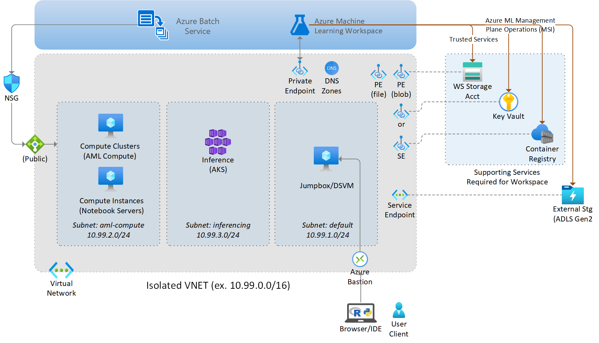
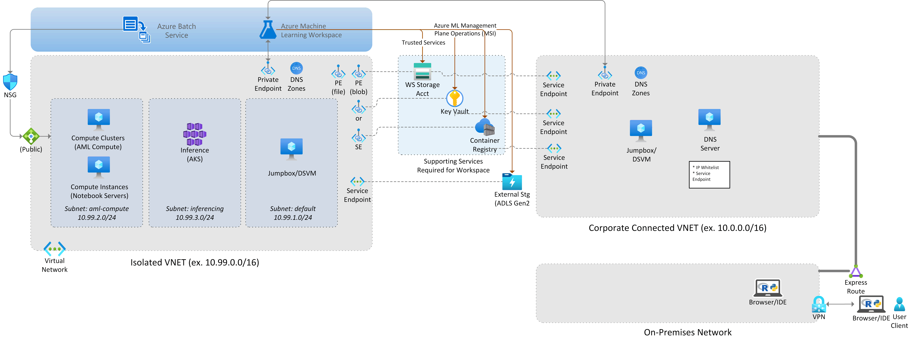

# Deploying a Secure Azure Machine Learning Workspace - Terraform Example
This repo shows an example for rolling out a complete Azure Machine Learning enterprise enviroment with network-secured resources via Terraform. This extends the original repo by including network security for all of the workspace dependent resources -- including Azure Container Registry, Azure Storage, and Azure Key Vault. 

This repository includes code for deploying an Azure ML workspace into a standalone, isolated VNET. This can be desirable in cases where you want further isolation from your corporate network or have contstraints on available resources. 

## Scenario 1: Workspace in standalone VNET with Workspace and Bastion Jumphost for Client Connectivity


This includes rollout of the following resources:

* Azure Machine Learning Workspace with Private Link
* A new Virtual Network and subnets for AML resources.
* Azure Storage Account with VNET binding (using Service Endpoints or Private Endpoints)
* Azure Key Vault with VNET binding (using Service Endpoints or Private Endpoints)
* Azure Container Registry with VNET binding (using Service Endpoints or Private Endpoints)
* Azure Application Insights
* Jumphost (Windows) with Bastion for easy access to the VNET
* AML Compute Cluster (in VNET)
* AML Compute Instance (in VNET)
* (Optional) - Azure Kubernetes Service - disabled by default

## Scenario 2: Workspace with isolated VNET for AML compute and Connected VNET for client traffic. [In Development]


This includes rollout of the following resources:

* Azure Machine Learning Workspace with Private Link
* A new Virtual Network and subnets for AML resources.
* A reference to an existing virtual network (e.g. your corporate network) where client traffic will originate from. 
* Azure Storage Account with VNET binding to both VNETs (using Service Endpoints or Private Endpoints)
* Azure Key Vault with VNET binding to both VNETs (using Service Endpoints or Private Endpoints)
* Azure Container Registry with VNET to both VNETs  binding (using Service Endpoints or Private Endpoints)
* Azure Application Insights
* Jumphost (Windows) with Bastion for easy access to the VNET
* AML Compute Cluster (in VNET)
* AML Compute Instance (in VNET)
* (Optional) - Azure Kubernetes Service - disabled by default


## Instructions
Make sure you have the [Azure CLI](https://docs.microsoft.com/en-us/cli/azure/install-azure-cli) and the Azure Machine Learning CLI extension installed (`az extension add -n azure-cli-ml`).

1. Copy `terraform.tfvars.example` to `terraform.tfvars`
1. Update `terraform.tfvars` with your desired values
2. Run Terraform
    ```console
    $ terraform init
    $ terraform plan
    $ terraform apply
    ```

If you want to deploy AKS, you need to have [Azure Machine Learning CLI installed](https://docs.microsoft.com/en-us/azure/machine-learning/reference-azure-machine-learning-cli).

# Known Limitations

* Still need to update `Default Datastore` to use Managed Identity of the Studio UI data access

# Important Notes

* The user fileshare for the Compute Instances will be automatically provisioned upon first instance access